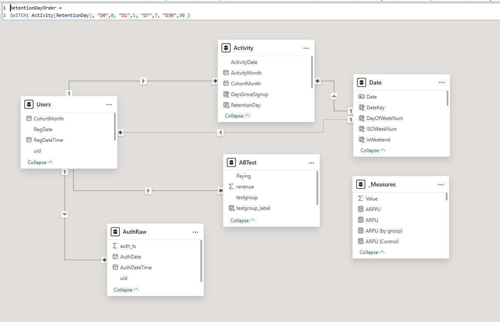
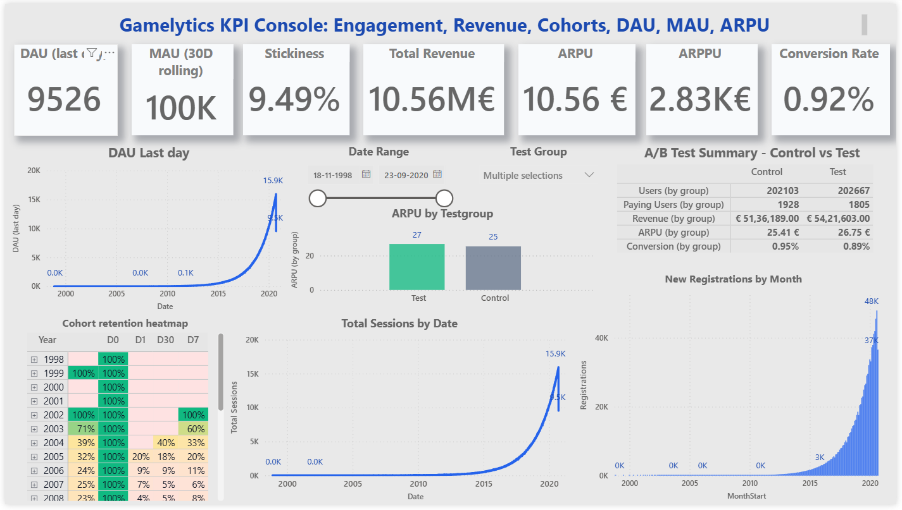

# 🎮 Gamelytics KPI Console (Power BI)
**Engagement • Monetization • Cohorts • A/B Results**

Professional BI analysis of player behavior using the **Gamelytics** dataset (registrations, logins, A/B revenue).  
The report focuses on **DAU/MAU & Stickiness**, **ARPU/ARPPU/Conversion**, and **Cohort Retention (D0/D1/D7/D30)**.

---

## 📌 Purpose
Give product & live-ops teams a clear view of **game health**:
- Are players active daily & monthly?
- Are monetization experiments improving revenue?
- Are new cohorts retaining (D1/D7/D30)?

---

## 🗺️ Repository Map
gamelytics-powerbi/
├─ README.md # You are here
├─ Gamelytics_Dashboard.pbix # Power BI report
├─ docs/ # Detailed docs (lineage, model, KPIs, cohorts…)
├─ diagrams/ # Model & lineage images
├─ screenshots/ # Dashboard images for this README/docs
└─ scripts/ # DAX measures (and optional PQ M)

---

## 🔗 Data Sources
- `reg_data.csv` → **Users** (registration timestamp → `RegDate`, `CohortMonth`)
- `auth_data.csv` → **Activity** (logins grouped to **user-day**, with `Sessions`)
- `ab_test.csv` → **ABTest** (user assigned to **Control/Test**, with `revenue`)
- **Date** table created via `CALENDAR(MIN(Users[RegDate]), MAX(Activity[ActivityDate]))`

> Notes: Timestamps are Unix **seconds**. `Activity` is pre-aggregated to user-day for performance.

---

## 🧩 Data Model

**Relationships**
- `Users[uid]` **1 → * ** `Activity[uid]`
- `Users[uid]` **1 → * ** `ABTest[user_id]`
- `Date[Date]` **1 → * ** `Activity[ActivityDate]` (active)
- `Date[Date]` **1 → * ** `Users[RegDate]` (**inactive**) — activated in measures (registrations)

---

## 🔄 Data Lineage

- `reg_data.csv` → **Users** (epoch → `RegDate`, `CohortMonth`)
- `auth_data.csv` → **AuthRaw** → **Activity** (group by `uid, AuthDate` → `Sessions`; join `CohortMonth`)
- `ab_test.csv` → **ABTest** (derive `Paying = revenue > 0`)
- **Date** via `CALENDAR` (min RegDate … max ActivityDate)

---

## 📊 KPIs & Measures
- **Engagement:** `DAU (last day)`, `MAU (30D rolling)`, `Stickiness = DAU/MAU`, `Total Sessions`, `Total Users`
- **Monetization:** `Total Revenue`, `ARPU`, `ARPPU`, `Conversion Rate`
- **A/B Summary:** Users / Paying Users / Revenue / ARPU / Conversion **by testgroup**
- **Cohorts/Retention:** `Cohort Size`, `Retained Users`, `Retention Rate`, `D1/D7/D30 %`

👉 Full DAX is in **[`/scripts/measures.md`](./scripts/measures.md)**.

---

## 🖼️ Dashboard Preview

Additional shots:
- KPI row — `./screenshots/dashboard-kpis.png`
- DAU trend — `./screenshots/dau-trend.png`
- ARPU by group — `./screenshots/arpu-by-group.png`
- A/B matrix — `./screenshots/ab-summary.png`
- Cohort heatmap — `./screenshots/cohort-heatmap.png`
- Sessions trend — `./screenshots/sessions-trend.png`
- Registrations by month — `./screenshots/registrations-by-month.png`

---

## 🧭 Findings (from this dashboard)
- **Engagement**
  - **DAU ≈ 9.5K** (last day), **MAU ≈ 100K** → **Stickiness ≈ 9.5%**.  
    Monthly audience is much larger than daily returners.
  - **DAU & Sessions** show long-term growth with sharp acceleration in recent years.

- **Monetization**
  - **Total Revenue ~ €10.56M**, **ARPU ≈ €10.56**, **ARPPU ≈ €2.83K**, **Conversion ≈ 0.92%**.  
    Revenue is concentrated among a small paying cohort (typical F2P). Double-check revenue units (may be cents).

- **A/B Test**
  - **Test ARPU (~€26.75)** > **Control (~€25.41)** → ~**5% uplift** visible in bar & matrix.

- **Retention (Cohorts)**
  - Exact-day retention: **D1 ~ 2%**, **D7 ~ 5–6%**, **D30 ~ 2–3%**; stable across cohorts.  
    (Exact-day is stricter than “within-window” metrics used by many teams.)

---

## 🛠️ Recommendations
1. **Add within-window retention** (1/7/30 days) alongside exact-day to align with industry benchmarks.  
2. **Validate revenue units.** If in cents, divide by 100 and re-format KPIs.  
3. **Monitor Stickiness trend** monthly (DAU/MAU) to track engagement quality, not just scale.  
4. **A/B guardrails.** Revenue in this dataset isn’t timestamped; current A/B view is global totals. Future dataset: **timestamped revenue** for time-sliced impact.  
5. **Performance hygiene.** Keep `AuthRaw` **load disabled** (only `Activity` loads), single-direction filters & one inactive date path; document in `/docs`.

---

## 🧭 How to Use the Report
- **Date Range** slicer filters time-series & KPIs.  
- **Test Group** slicer filters A/B bar & matrix (Control/Test).  
- **Cohort heatmap**: rows = `CohortMonth (YYYY-MM)`, columns = **D0/D1/D7/D30**, values = **Retention %**.

---

## ▶️ Run Locally
1. Open **`Gamelytics_Dashboard.pbix`** in **Power BI Desktop** (latest).  
2. If prompted for data paths, point to the three CSVs.  
3. Interact with slicers; explore the pages/visuals.

---

## 📄 License & Attribution
- Code & docs: **MIT** (see `LICENSE`).  
- Dataset: **Gamelytics** (three CSVs as described above). Please respect the original dataset’s license/terms.

---
